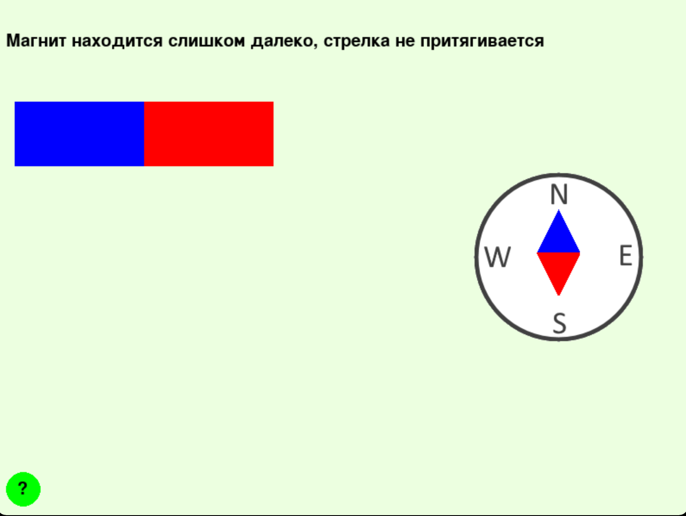

# Hlupak
Симулятор физических явлений
----------------------------
Это проект по Яндекс Лицею, но в отличии от многих проектов тут, это не игра. Наш проект показывает некоторые из возможностей библиотеки PyGame в виде
симулятора физических явлений. Перейдем к самой программе.

Управление: 
----------
Перемещение по главному меню осуществляется стрелочками право и лево. \
Симуляция идеального газа: стрелочками вверх и вниз можно изменять температуру, нажатие левой кнопкой мыши добавляет 15 шаров, правой - удаляет 15 шаров.\
Симулятор рычага: можно брать грузики и ставить их на разные плечи.\
Симулятор реального газа: Все также, как и симуляции идеального газа.\
Симулятор магнитной стрелки: можно взять магнит и подносить его к компасу.\
Сообщающиеся сосуды: нажимая на кнопки, можно менять жидкости в сосуде.

Скриншоты:
---------
Симулятор идеального газа: \

Симулятор реального газа: \

Симулятор рычага: \
 \
Симулятор магнитной стрелки: \

Симулятор сообщающихся сосудов:\

